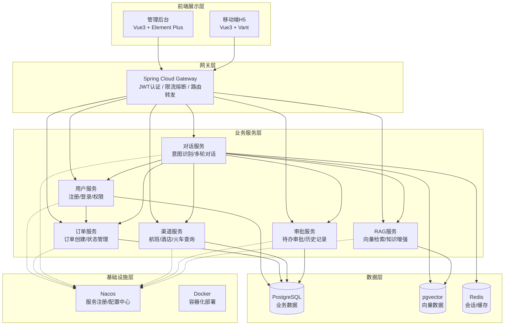

# 系统分层逻辑架构图

```mermaid
flowchart TB
subgraph 前端层 [前端展示层]
A1[管理后台<br/>Vue3 + Element Plus]
A2[移动端H5<br/>Vue3 + Vant]
end

    subgraph 网关层 [网关层]
        B[Spring Cloud Gateway<br/>JWT认证 / 限流熔断 / 路由转发]
    end

    subgraph 业务服务层 [业务服务层]
        C1[用户服务<br/>注册/登录/权限]
        C2[订单服务<br/>订单创建/状态管理]
        C3[对话服务<br/>意图识别/多轮对话]
        C4[渠道服务<br/>航班/酒店/火车查询]
        C5[审批服务<br/>待办审批/历史记录]
        C6[RAG服务<br/>向量检索/知识增强]
    end

    subgraph 数据层 [数据层]
        D1[(PostgreSQL<br/>业务数据)]
        D2[(pgvector<br/>向量数据)]
        D3[(Redis<br/>会话/缓存)]
    end

    subgraph 基础设施层 [基础设施层]
        E1[Nacos<br/>服务注册/配置中心]
        E2[Docker<br/>容器化部署]
    end

    A1 --> B
    A2 --> B
    B --> C1
    B --> C2
    B --> C3
    B --> C4
    B --> C5
    B --> C6
    
    C1 --> D1
    C2 --> D1
    C4 --> D1
    C5 --> D1
    C3 --> D3
    C3 --> D2
    C6 --> D2
    
    C1 -.-> E1
    C2 -.-> E1
    C3 -.-> E1
    C4 -.-> E1
    C5 -.-> E1
    C6 -.-> E1
    
    C1 --> C2
    C3 --> C1
    C3 --> C2
    C3 --> C4
    C3 --> C5
    C3 --> C6

```