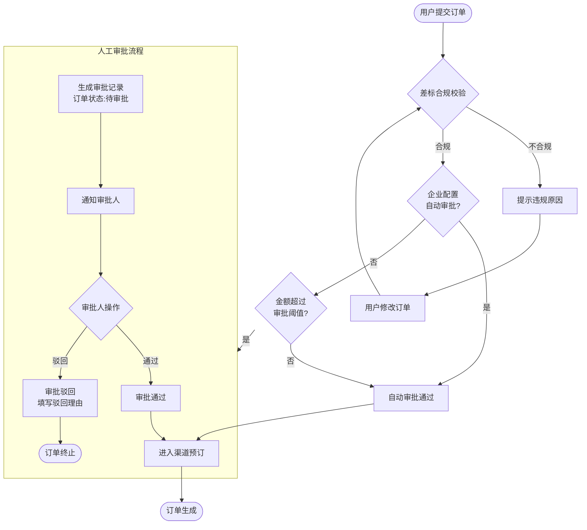

# 流程审批逻辑图

```mermaid
flowchart TD
    Start([用户提交订单]) --> CheckCompliance{差标合规校验}
    
    CheckCompliance -->|不合规| Violation[提示违规原因]
    Violation --> Resubmit[用户修改订单]
    Resubmit --> CheckCompliance
    
    CheckCompliance -->|合规| CheckAuto{企业配置<br/>自动审批?}
    
    CheckAuto -->|是| AutoApprove[自动审批通过]
    AutoApprove --> Booking[进入渠道预订]
    Booking --> End1([订单生成])
    
    CheckAuto -->|否| CheckAmount{金额超过<br/>审批阈值?}
    CheckAmount -->|是| ManualFlow
    CheckAmount -->|否| AutoApprove
    
    subgraph ManualFlow [人工审批流程]
        direction TB
        CreateApproval[生成审批记录<br/>订单状态:待审批]
        CreateApproval --> Notify[通知审批人]
        Notify --> ApproveAction{审批人操作}
        ApproveAction -->|通过| ApprovePass[审批通过]
        ApproveAction -->|驳回| ApproveReject[审批驳回<br/>填写驳回理由]
        ApproveReject --> RejectEnd([订单终止])
        ApprovePass --> Booking
    end

```