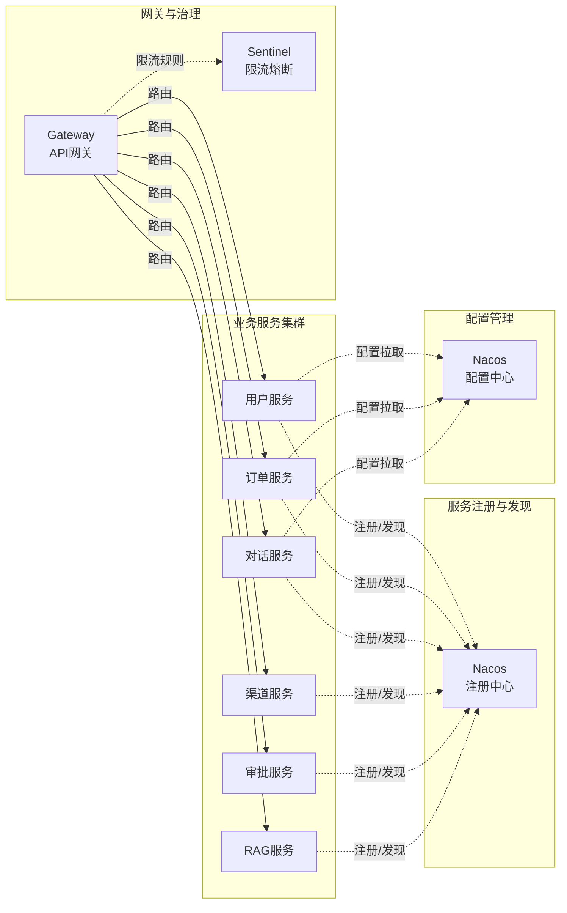

# 微服务注册与发现

```mermaid
flowchart LR
    subgraph 服务注册与发现
        N[Nacos<br/>注册中心]
    end

    subgraph 业务服务集群
        U[用户服务]
        O[订单服务]
        D[对话服务]
        C[渠道服务]
        A[审批服务]
        R[RAG服务]
    end

    subgraph 网关与治理
        G[Gateway<br/>API网关]
        S[Sentinel<br/>限流熔断]
    end

    subgraph 配置管理
        NC[Nacos<br/>配置中心]
    end

    U -.->|注册/发现| N
    O -.->|注册/发现| N
    D -.->|注册/发现| N
    C -.->|注册/发现| N
    A -.->|注册/发现| N
    R -.->|注册/发现| N

    G -->|路由| U
    G -->|路由| O
    G -->|路由| D
    G -->|路由| C
    G -->|路由| A
    G -->|路由| R

    G -.->|限流规则| S
    U -.->|配置拉取| NC
    O -.->|配置拉取| NC
    D -.->|配置拉取| NC

```