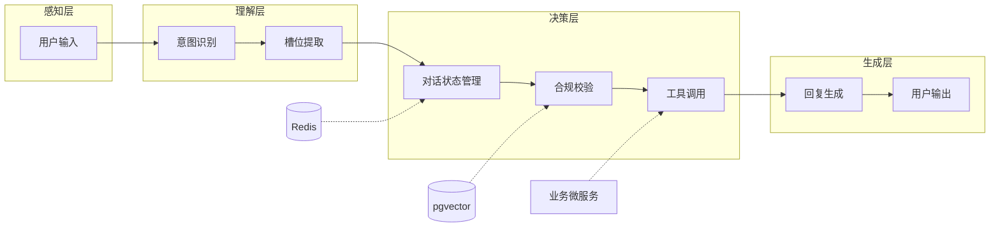

# 对话服务处理流程架构图

```mermaid
flowchart LR
subgraph 感知层
A[用户输入]
end

    subgraph 理解层
        B[意图识别]
        C[槽位提取]
    end
    
    subgraph 决策层
        D[对话状态管理]
        E[合规校验]
        F[工具调用]
    end
    
    subgraph 生成层
        G[回复生成]
        H[用户输出]
    end
    
    A --> B --> C --> D --> E --> F --> G --> H
    
    I[(Redis)] -.-> D
    J[(pgvector)] -.-> E
    K[业务微服务] -.-> F

```