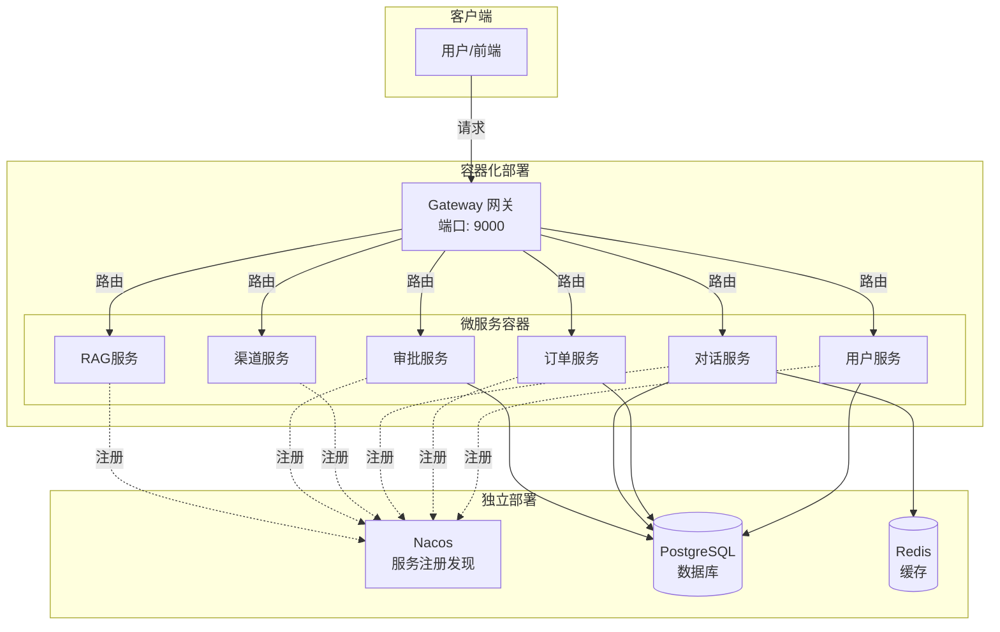

```mermaid
flowchart TB
subgraph 客户端
Client[用户/前端]
end

    subgraph 容器化部署
        Gateway[Gateway 网关<br/>端口: 9000]
        
        subgraph 微服务容器
            User[用户服务]
            Order[订单服务]
            Chat[对话服务]
            Channel[渠道服务]
            Approval[审批服务]
            RAG[RAG服务]
        end
    end

    subgraph 独立部署
        Nacos[Nacos<br/>服务注册发现]
        PostgreSQL[(PostgreSQL<br/>数据库)]
        Redis[(Redis<br/>缓存)]
    end

    Client -->|请求| Gateway
    Gateway -->|路由| User
    Gateway -->|路由| Order
    Gateway -->|路由| Chat
    Gateway -->|路由| Channel
    Gateway -->|路由| Approval
    Gateway -->|路由| RAG

    User -.->|注册| Nacos
    Order -.->|注册| Nacos
    Chat -.->|注册| Nacos
    Channel -.->|注册| Nacos
    Approval -.->|注册| Nacos
    RAG -.->|注册| Nacos

    User --> PostgreSQL
    Order --> PostgreSQL
    Chat --> PostgreSQL
    Approval --> PostgreSQL
    
    Chat --> Redis
```